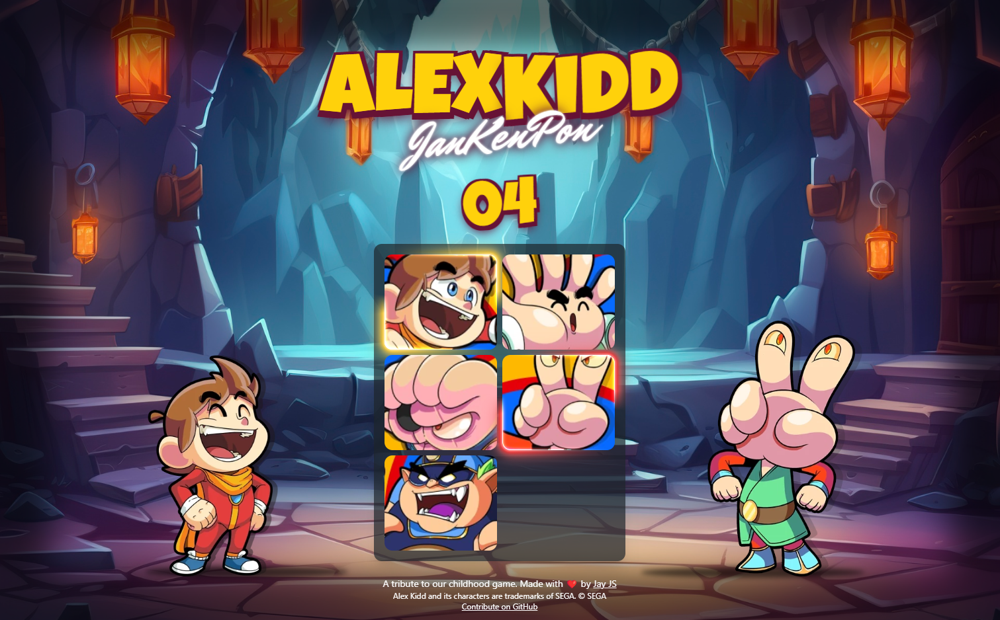

# 🕹️ Alex Kidd Jan Ken Pon 

This project is a tribute to the classic game "Alex Kidd in Miracle World" from the SEGA Master System. It utilizes modern web technologies to create a multiplayer Jan Ken Pon (rock-paper-scissors) experience managed through websockets.




## Technologies Used

### Server
- **Fastify**: Fast and low overhead web framework, for Node.js.
- **Socket.IO**: Real-time, bidirectional and event-based communication.

### Client
- **Jay-JS**: A high-performance framework for building web applications.
- **Socket.IO**: Real-time, bidirectional and event-based communication.
- **Tailwind CSS**: A utility-first CSS framework for rapid UI development.


## Game Overview

- Players can request to join a match.
- If no matches are available, a new match is created and the player becomes the "HOST".
- Subsequent player join a challenger to the existing match.
- The game is best of 3 rounds of Jan Ken Pon (rock-paper-scissors).
- The player with the most wins at the end of the 3 rounds is the winner.
- Only rounds with a clear winner are counted; ties are ignored.
- Supports multiple matches at the same time.

## Getting Started

### Server

The server side of the application can be run using Docker.

1. **Build the Docker Image**
    ```bash
    docker build -t alex-kidd-server .
    ```

2. **Run the Docker Container**
    ```bash
    docker run -p 3000:3000 alex-kidd-server
    ```

To run the server in a development environment:

1. **Install Dependencies**
    ```bash
    pnpm install
    ```

2. **Run the Development Server**
    ```bash
    pnpm dev
    ```

### Client

To run the client side of the application:

1. **Install Dependencies**
    ```bash
    pnpm install
    ```

2. **Run the Development Server**
    ```bash
    pnpm dev
    ```

## Inspirations and Sources

- [Game Title Text Effect](https://codepen.io/kylewetton/pen/yLBwdJX)
- [Jakenpon Text Effect](https://codepen.io/ykadosh/pen/zYNxVKr)
- [Button Shimmer](https://codepen.io/simeydotme/pen/gOqNxRa)
- [Background assets provided by Vecteezy](https://www.vecteezy.com/free-photos/game).
- [Alex Kidd Assets by Fandom](https://alex-kidd.fandom.com/wiki/).

## Legal Notice

This project respects copyright laws and is intended solely for educational purposes to showcase the use of modern web technologies. It is a tribute to the game "Alex Kidd in Miracle World," and all trademarks, characters, and assets belong to SEGA.

## Proudly Developed With Jay-JS

This game was proudly developed using the [Jay-JS framework](https://github.com/AJCastello/jay-js), which offers high performance and flexibility for web development.

## ❤️ Contributing 

We welcome contributions from the community! Whether you're fixing bugs, adding new features, or improving documentation, your help is greatly appreciated.

### How to Contribute

1. **Fork the Repository**: Click the "Fork" button at the top right of this page.
2. **Clone Your Fork**: Clone your forked repository to your local machine.
    ```bash
    git clone https://github.com/AJCastello/alexkidd-jankenpon.git
    ```
3. **Create a Branch**: Create a new branch for your feature or bug fix.
    ```bash
    git checkout -b feature/your-feature-name
    ```
4. **Make Changes**: Make your changes to the codebase.
5. **Commit Changes**: Commit your changes with a clear and descriptive commit message.
    ```bash
    git commit -m "Add feature: your feature description"
    ```
6. **Push to Your Fork**: Push your changes to your forked repository.
    ```bash
    git push origin feature/your-feature-name
    ```
7. **Open a Pull Request**: Open a pull request to merge your changes into the main repository. Provide a clear description of your changes and any related issues.

Thank you for your contributions! Together, we can make this project even better.